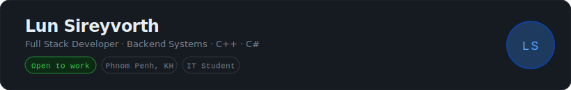

 

  

---

## About

Backend-focused developer passionate about **system design, API architecture, and databases**. Currently studying IT while building real-world systems that solve practical problems. Expanding into **networking and ethical hacking** to deepen my understanding of security.

**Goal:** Senior Software Engineer.

---

## Focus Areas

| Core Expertise | Currently Learning |
|---|---|
| System Design & Architecture | Networking & Protocols |
| REST API Development | Ethical Hacking & Security |
| Database Design (SQL & NoSQL) | Cloud Infrastructure (AWS) |
| Backend Development | DevOps & Containerization |

---

## Tech Stack

**Languages**

**Frameworks & Libraries**

**Databases**

**Tools & Infrastructure**

---

## Projects

### Coffee Management System
Console-based application built in C++ featuring user authentication, menu CRUD operations, order processing, and report generation.

### Hotel Management System
Built with C#. Covers the full guest lifecycle — reservations, check-in/out, room management, and reporting.

### Point of Sale (POS) System
Product catalog management, order processing, and integrated payment flow for retail environments.

---

## GitHub Stats

  
  &nbsp;
  

  

---

## Contact

- **Email:** lunsereyvorth@email.com
- **Facebook:** [lunsireyvorth](https://web.facebook.com/lunsireyvorth)
- **LinkedIn:** *(add your link here)*

---

  <i>"I love building real-world systems and solving problems with code."</i>

